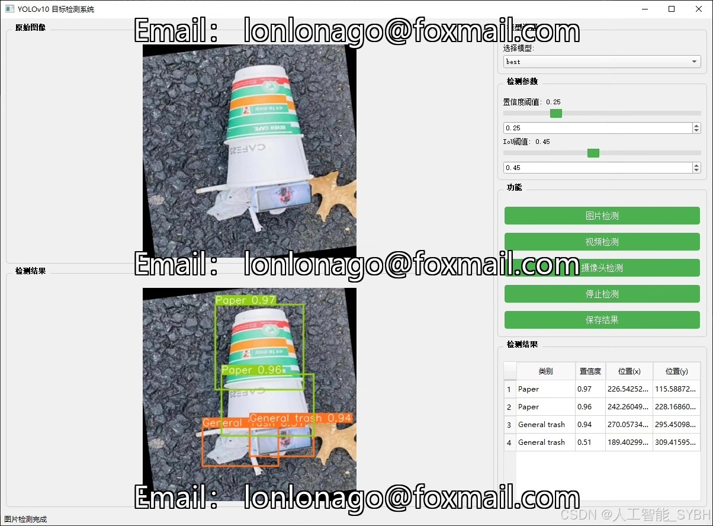
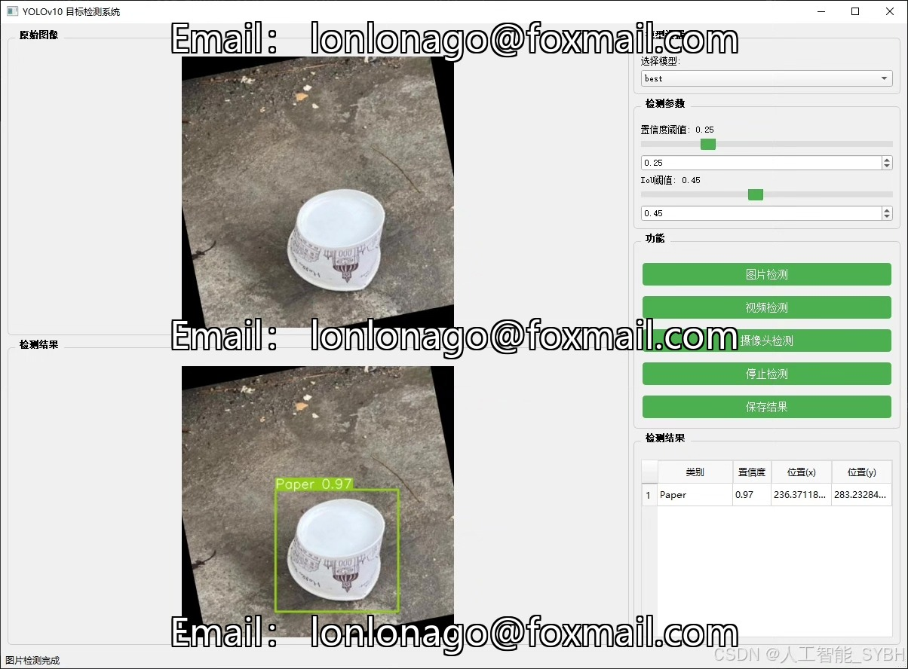
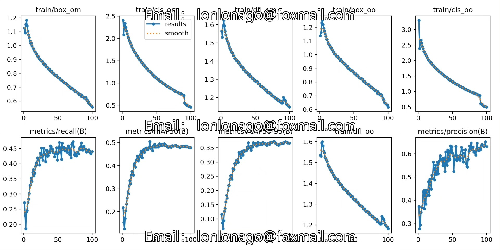
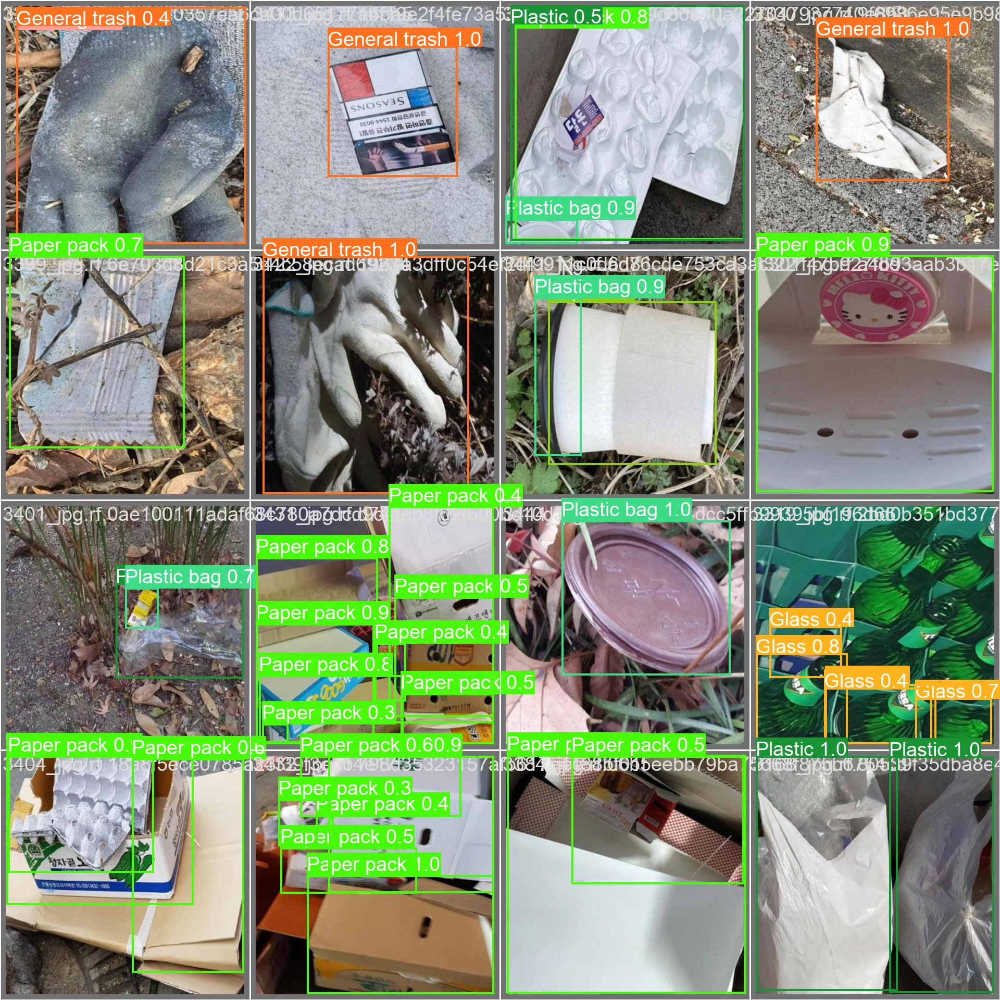
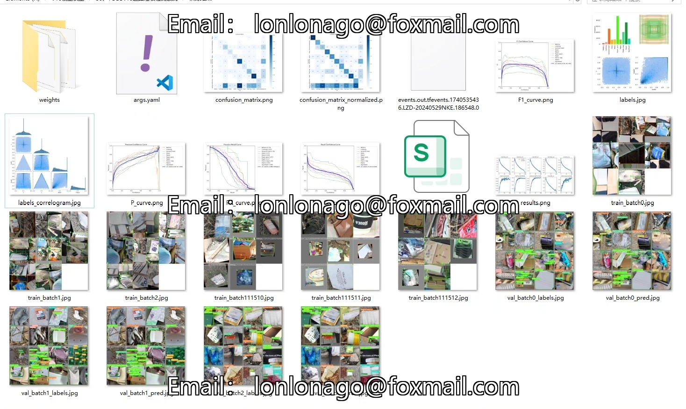
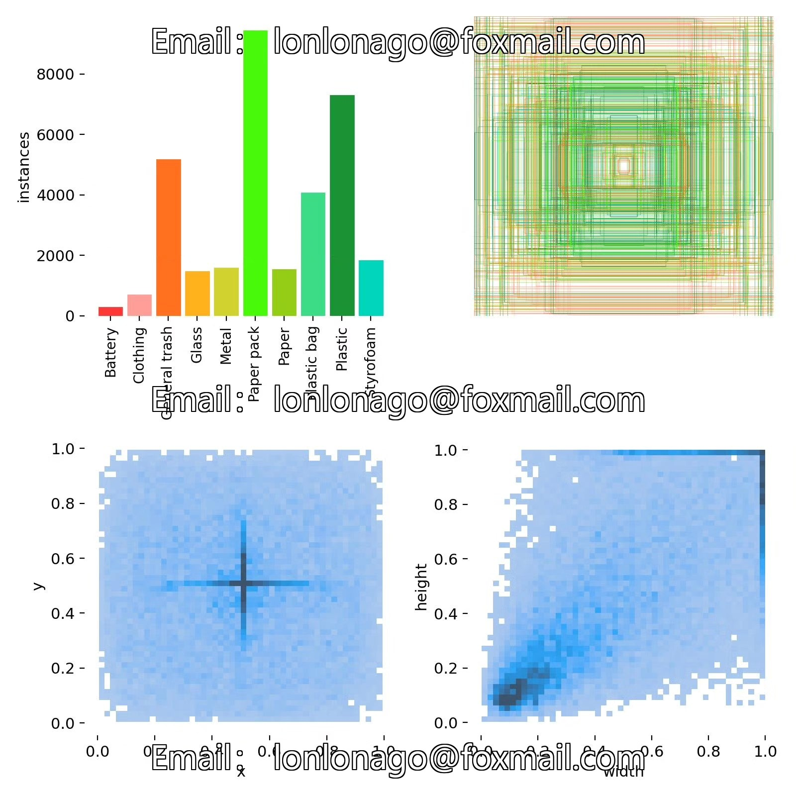
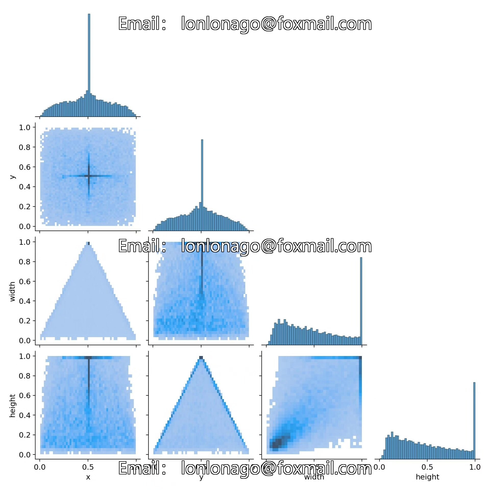
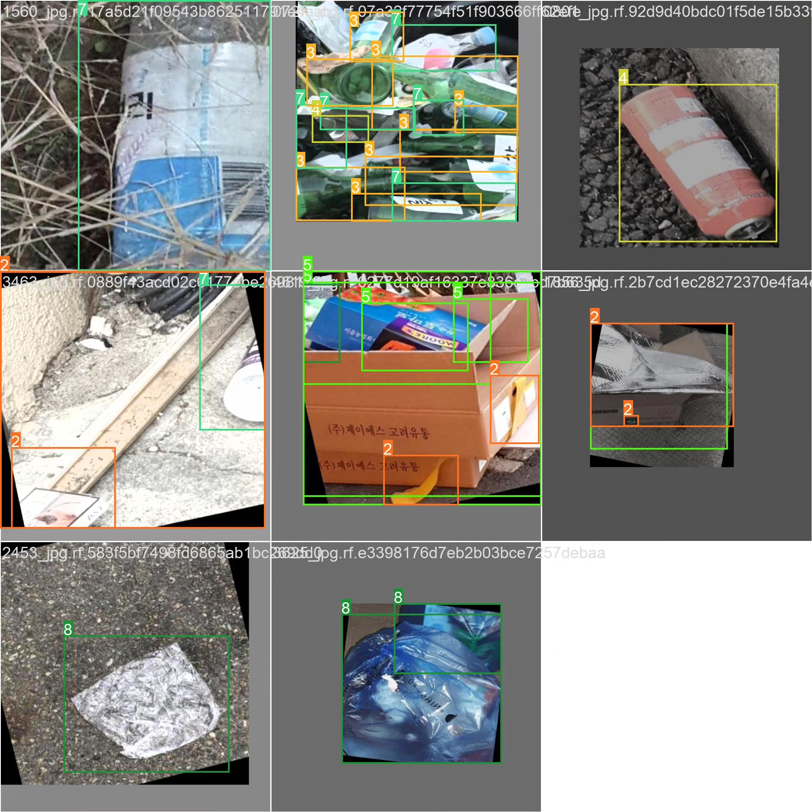

# Based on YOLOv10 deep learning road trash detection system

## Body

This project utilizes the YOLOv10 (You Only Look Once version 10) object detection algorithm to develop an efficient road waste detection system. This system can automatically detect waste from road images or videos and classify it into different types of waste (such as batteries, clothing, general waste, glass, metal, paper packaging, paper, plastic bags, plastic, foam plastic), providing support for intelligent waste cleaning and sorting recycling.

The company's products have obtained the official commercial license certification of YOLO.

We provide after-sales service.

After payment, we will provide WeChat IDs for any questions you may have.

Environment configuration: We will provide a tutorial on how to configure the environment, and WeChat will provide answers to your questions.

Remote installation services: If you need remote configuration, an additional fee of 69 is required, with all fees refunded if the configuration fails (only the installation fee is refunded for older computers).

Retraining dataset: After configuring the environment, you can train on your own computer. If you need us to retrain, just pay 69 plus the computing power fee (2.5 yuan/hour).

Full after-sales service

## Images

## Payment

Here is a pay link on Stripe ( https://buy.stripe.com/3cs8yP7sY87d0vu9AB ). Please contact me lonlonago@foxmail.com after funding $89, and I will send you a complete data files , thank you!

